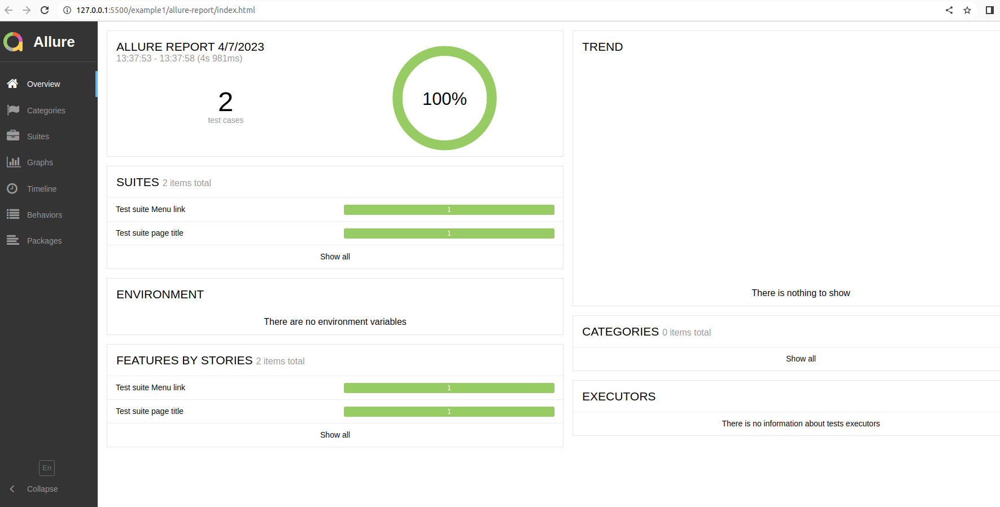

## To run the selenium grid with docker compose
* Make sure to have docker installed
* Navigate to the root folder of the project and run the command:

```
docker compose up
```
## To enter a running instance of docker running with docker compose
* If you want to enter e.g. the chrome service, you can issue the command:
```
docker compose exec chrome sh
```

## To run the tests locally on chrome
* Make sure if you have chrome installed
* If you want to run the tests:

```
npm install
npm run test-chrome
```
Running the tests on chrome will help you when developing more test cases and debugging eventual problems.

## To run the tests on docker 
* Make sure to have docker installed on the runner machine.
* Make sure to have java 1.8 (or later) installed. This is required since there is a simple test report generated with allure command and this requires java 1.8.
* Make sure to have allure command installed. (https://www.npmjs.com/package/allure-commandline)

```
docker compose up
npm run test
```

The test results are generated into a folder called /allure-report and they look like this:

